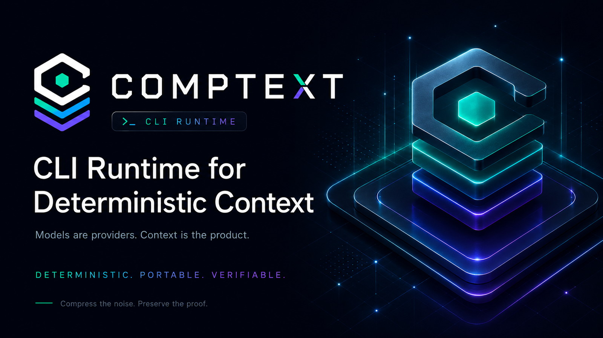
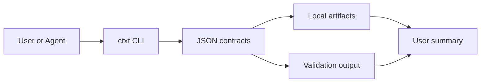
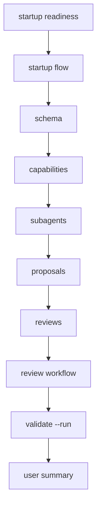
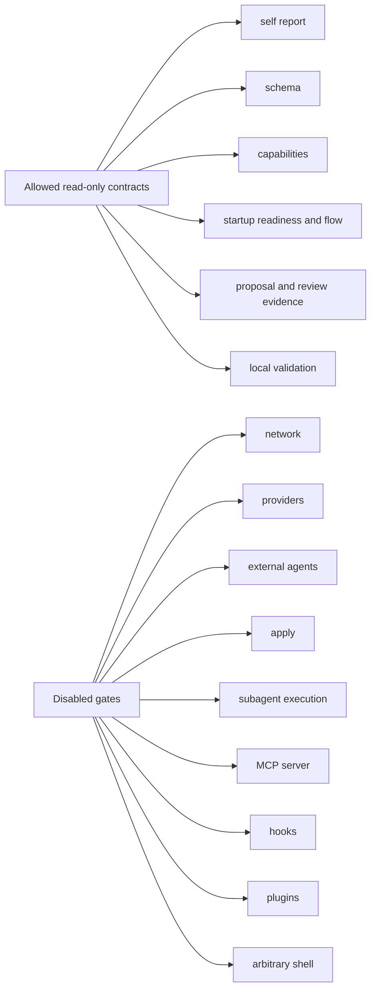
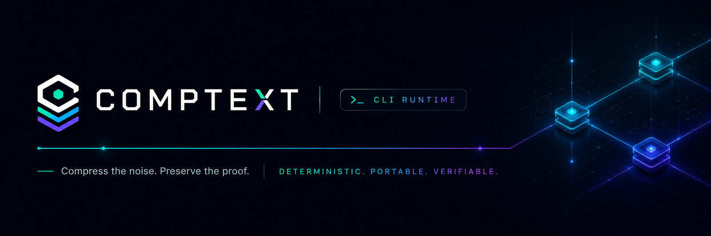

<p align="center">
  
</p>
<div align="center">

# CompText `ctxt`

**Deterministic contract runtime for agent-friendly local review workflows.**

**Models are providers. Context is the product.**

It does not execute external agents, use network, call providers, apply proposals or reviews, or run subagents.


</div>

CompText `ctxt` v0.1.0 is a local-first Rust CLI for deterministic, schema-oriented review workflow contracts. It gives Codex, Antigravity, and human reviewers stable JSON entrypoints for startup checks, capability discovery, proposal evidence, review evidence, subagent role contracts, and validation summaries before any higher-risk action is considered.

The current release candidate is focused on contract clarity, local evidence, and safe startup behavior. It is not an autonomous coding system, not a provider gateway, and not a remote orchestration layer.

## Table of Contents

- [Why CompText](#why-comptext)
- [Architecture](#architecture)
- [Deterministic Review Workflow](#deterministic-review-workflow)
- [Safety Boundary](#safety-boundary)
- [Quickstart](#quickstart)
- [Command Matrix](#command-matrix)
- [Capability Matrix](#capability-matrix)
- [Safety Matrix](#safety-matrix)
- [Validation Evidence](#validation-evidence)
- [Visual Asset Plan](#visual-asset-plan)
- [Roadmap](#roadmap)
- [Contributing](#contributing)
- [License](#license)

## Why CompText

Most agent workflows start with ambiguous state and only later discover whether the environment was safe, validated, or consistent. CompText flips that order:

1. expose local runtime contracts first,
2. report capabilities before actions,
3. keep artifacts bounded and inspectable,
4. make disabled gates explicit,
5. validate locally before claims,
6. summarize evidence for the user.

The result is a small CLI surface that helps an agent or reviewer answer: what is available, what is disabled, what evidence exists, and what local validation says.

## Architecture


```mermaid
flowchart LR
    user["User or Agent"] --> cli["ctxt CLI"]
    cli --> contracts["JSON contracts"]
    contracts --> artifacts["Local artifacts"]
    contracts --> validation["Validation output"]
    artifacts --> summary["User summary"]
    validation --> summary
```

`ctxt` is intentionally boring at the boundary: commands produce local JSON contracts and evidence-oriented output. That makes it easier for automation to inspect state without assuming permission to mutate files, call providers, or reach the network.

## Deterministic Review Workflow


```mermaid
flowchart TD
    readiness["startup readiness"] --> flow["startup flow"]
    flow --> schema["schema"]
    schema --> capabilities["capabilities"]
    capabilities --> subagents["subagents"]
    subagents --> proposals["proposals"]
    proposals --> reviews["reviews"]
    reviews --> workflow["review workflow"]
    workflow --> validate["validate --run"]
    validate --> summary["user summary"]
```

The review workflow is a contract-only checklist. Each command is run explicitly by the user or agent inside the allowed task scope. The workflow does not imply remote execution, hidden automation, or automatic application of recommendations.

## Safety Boundary


```mermaid
flowchart LR
    contracts["Allowed read-only contracts"] --> self["self report"]
    contracts --> schema["schema"]
    contracts --> capabilities["capabilities"]
    contracts --> startup["startup readiness and flow"]
    contracts --> evidence["proposal and review evidence"]
    contracts --> validation["local validation"]

    disabled["Disabled gates"] --> network["network"]
    disabled --> providers["providers"]
    disabled --> external["external agents"]
    disabled --> apply["apply"]
    disabled --> subexec["subagent execution"]
    disabled --> mcp["MCP server"]
    disabled --> hooks["hooks"]
    disabled --> plugins["plugins"]
    disabled --> shell["arbitrary shell"]
```

Disabled gates are explicit by design. Contract output and artifacts are evidence, not proof that an unsafe action is allowed.

## Quickstart

Clone the repository and run the local validation sequence from PowerShell:

```powershell
git clone https://github.com/ProfRandom92/comptext-cli.git
cd comptext-cli
cargo fmt --all --check
cargo check
cargo test
cargo clippy -- -D warnings
```

Inspect the local runtime contracts:

```powershell
cargo run --bin ctxt -- --json self report
cargo run --bin ctxt -- --json startup readiness
cargo run --bin ctxt -- --json startup flow
cargo run --bin ctxt -- --json review workflow
cargo run --bin ctxt -- --json validate --run
```

All commands are local CLI invocations. The documented review workflow does not enable network access, provider calls, external agent execution, proposal application, review application, or subagent execution.

## Command Matrix

| Command | Purpose | Output style | Safety posture |
|---|---|---|---|
| `cargo run --bin ctxt -- --json self report` | Local runtime baseline and safe entrypoints | JSON | Read-only contract |
| `cargo run --bin ctxt -- --json schema` | Supported JSON command shapes | JSON | Static contract |
| `cargo run --bin ctxt -- --json capabilities` | Supported features and disabled gates | JSON | Read-only contract |
| `cargo run --bin ctxt -- --json startup readiness` | Startup readiness status | JSON | Contract-only report |
| `cargo run --bin ctxt -- --json startup flow` | Safe startup sequence | JSON | Contract-only checklist |
| `cargo run --bin ctxt -- --json review workflow` | Deterministic review workflow plan | JSON | Contract-only checklist |
| `cargo run --bin ctxt -- --json subagents list` | Deterministic subagent role contracts | JSON | Lists roles only |
| `cargo run --bin ctxt -- --json proposals list` | Local proposal artifact index | JSON | Read-only evidence |
| `cargo run --bin ctxt -- --json proposals inspect latest --max-bytes 12000` | Bounded latest proposal read | JSON | Read-only evidence |
| `cargo run --bin ctxt -- --json proposals validate latest` | Validate proposal artifact contract | JSON | Validation only |
| `cargo run --bin ctxt -- --json reviews list` | Local review artifact index | JSON | Read-only evidence |
| `cargo run --bin ctxt -- --json reviews inspect latest --max-bytes 12000` | Bounded latest review read | JSON | Read-only evidence |
| `cargo run --bin ctxt -- --json reviews validate latest` | Validate review artifact contract | JSON | Validation only |
| `cargo run --bin ctxt -- --json agent discover` | Local agent discovery metadata | JSON | Discovery only |
| `cargo run --bin ctxt -- --json runs list` | Local run artifact index | JSON | Read-only evidence |
| `cargo run --bin ctxt -- --json runs read latest --max-bytes 12000` | Bounded latest run read | JSON | Read-only evidence |
| `cargo run --bin ctxt -- --json validate --run` | Local validation contract execution | JSON | Local validation |

## Capability Matrix

| Capability | v0.1.0 RC status | Notes |
|---|---:|---|
| Runtime self-reporting | Available | Local JSON contract |
| Schema introspection | Available | Stable command-shape discovery |
| Capabilities introspection | Available | Reports supported features and disabled gates |
| Startup readiness | Available | Contract-only readiness report |
| Startup flow | Available | Contract-only startup checklist |
| Review workflow planning | Available | Deterministic workflow checklist |
| Proposal artifact listing | Available | Local evidence inspection |
| Proposal artifact inspection | Available | Bounded reads with max-byte limits |
| Proposal artifact validation | Available | Contract validation only |
| Review artifact listing | Available | Local evidence inspection |
| Review artifact inspection | Available | Bounded reads with max-byte limits |
| Review artifact validation | Available | Contract validation only |
| Subagent role contracts | Available | Deterministic role definitions only |
| Local agent discovery | Available | Discovery metadata only |
| Run artifact inspection | Available | Local evidence inspection |
| Local validation | Available | `validate --run` contract |
| MCP server | Not implemented | Badge and matrix state this explicitly |
| Provider execution | Disabled | No live provider call is part of this README workflow |
| External agent execution | Disabled | Discovery and contracts do not execute agents |
| Proposal or review application | Disabled | Application is outside this release-candidate README workflow |
| Subagent runtime execution | Disabled | Role contracts are not execution |

## Safety Matrix

| Boundary | Default | Rationale |
|---|---|---|
| Network | Denied | Local evidence and deterministic contracts come first |
| Provider calls | Denied | Providers are not needed for contract inspection |
| External agents | Denied | Discovery is metadata, not execution |
| Proposal apply | Denied | Proposal artifacts are untrusted evidence |
| Review apply | Denied | Review artifacts are untrusted evidence |
| Subagent execution | Denied | Listed subagents are role contracts only |
| MCP server | Not implemented | No README claim should imply MCP availability |
| Hooks and plugins | Disabled for this flow | Not required for v0.1.0 contract-runtime validation |
| Arbitrary shell | Out of scope | Use declared validation commands only |
| Secrets | Never read or printed | Secret material must not enter reports, logs, artifacts, or context packs |
| Git writes | User-authorized only | Commit, push, tag, and release require explicit instruction |

## Validation Evidence

Current local release-candidate baseline from `PROJEKT.md`:

```text
cargo fmt --all --check: green
cargo check: green
cargo test: green
cargo clippy -- -D warnings: green
cargo run --bin ctxt -- --json validate --run: green
unit tests: 37 green
smoke tests: 83 green
```

Recommended local validation before reporting success:

```powershell
cargo fmt --all --check
cargo check
cargo test
cargo clippy -- -D warnings
cargo run --bin ctxt -- --json validate --run
```

## Visual Asset Plan

README diagrams stay as Mermaid so they remain version-controlled, reviewable, and rendered directly by GitHub.

Figma can be used later for a GitHub README header, social preview card, footer strip, architecture poster, and launch image. Generated asset references should not be added unless matching files already exist in the repository and the active task explicitly allows them.

## Roadmap

The active project source of truth is `PROJEKT.md`, and concrete work slices live in `tasks/*.md`.

Near-term release-candidate priorities:

- keep README and task state aligned with Phase 5e,
- preserve deterministic JSON contract behavior,
- keep local validation green,
- improve community-facing examples without widening runtime permissions,
- add visual assets only in a dedicated visual-assets task.

## Contributing

Contributions should preserve the core safety model:

- deterministic contracts before provider interaction,
- dry-run before network,
- proposal before apply,
- model, provider, and tool output treated as untrusted input,
- local validation before success claims,
- no secrets in stdout, stderr, reports, context packs, proposals, snapshots, logs, or generated artifacts.

For README/community work, stay inside the declared task scope and validate with:

```powershell
git --no-pager diff -- README.md
git --no-pager status --short --branch
```

## License

MIT.
<p align="center">
  
</p>


